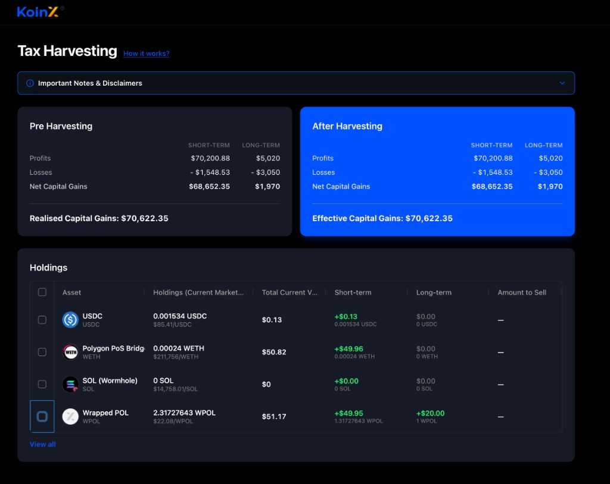
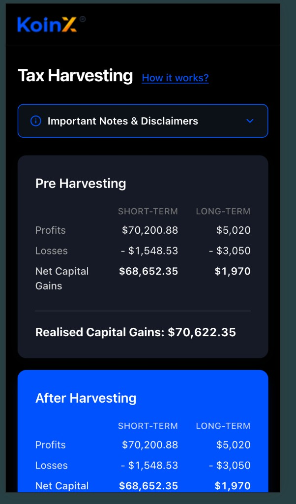
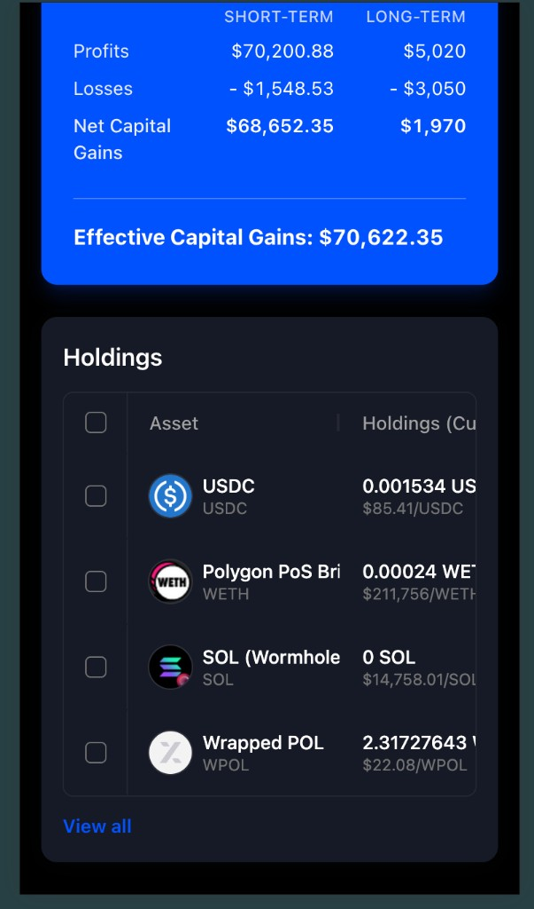

# KoinX — Tax Harvesting

The live site is deployed on **Netlify**: [koinx-production.netlify.app](https://koinx-production.netlify.app/).

A focused **React** dashboard for comparing capital gains before and after tax-loss harvesting, with a holdings grid powered by **AG Grid**.

| Resource               | Link                                                                   |
| ---------------------- | ---------------------------------------------------------------------- |
| **Live app (Netlify)** | [koinx-production.netlify.app](https://koinx-production.netlify.app/)  |
| **Source code**        | [github.com/Punyashreekm/Koinx](https://github.com/Punyashreekm/Koinx) |

---

## What’s in this repo

- **Working React app** — Vite + React 19, ready to run locally and build for production.
- **Clear folder structure** — routing, layouts, API layer, and the tax-harvesting feature live under predictable paths (see below).
- **Documented setup** — clone, install, dev server, and build commands.
- **Screenshots** — representative desktop and mobile views are included under `docs/screenshots/`.
- **Deployed demo** — hosted on Netlify (link above).

---

## Tech stack

- [Vite](https://vitejs.dev/) — dev server and production build
- [React 19](https://react.dev/) — UI
- [Tailwind CSS](https://tailwindcss.com/) — styling
- [Redux Toolkit](https://redux-toolkit.js.org/) + RTK Query — store and async data layer
- [AG Grid](https://www.ag-grid.com/react-data-grid/) — holdings table (Theming API, dark quartz theme)
- [React Router](https://reactrouter.com/) — client-side routing

---

## Project structure

```text
src/
├── api/
│   ├── store.js                 # Redux store (tax harvesting API only)
│   └── services/
│       └── taxHarvesting.js     # RTK Query endpoints (mock delays today)
├── app/
│   └── tax-harvesting/          # Feature: page, cards, grid, CSS, helpers
│       ├── index.jsx
│       ├── tax-harvesting.css
│       ├── ag-holdings-table/
│       ├── components/
│       └── lib/
├── components/                  # Shared UI (spinner, accordion, tooltip, toaster)
├── layouts/
│   └── main-layout.jsx
├── providers/
│   └── AppBootstrap.jsx
├── routes/
│   ├── index.jsx              # Route table + lazy imports
│   └── router.jsx
├── lib/
│   └── utils.js               # `cn()` and shared helpers
├── App.jsx
├── main.jsx
└── index.css
docs/
└── screenshots/               # README screenshots (not bundled by Vite)
public/                        # Static assets (favicon, etc.)
```

---

## Setup

**Prerequisites:** Node.js **18+** (LTS recommended) and npm.

```bash
git clone https://github.com/Punyashreekm/Koinx.git
cd Koinx
npm install
```

**Development**

```bash
npm run dev
```

Open the URL Vite prints (usually `http://localhost:5173`).

**Production build**

```bash
npm run build
npm run preview   # optional: serve dist/ locally
```

**Lint**

```bash
npm run lint
```

---

## Screenshots

### Desktop — Pre / After harvesting and holdings grid



### Mobile — Pre and After harvesting cards



### Mobile — Capital gains summary and holdings list



---

## Assumptions & API integration

- **Mock data today:** capital gains and holdings are loaded via **mocked RTK Query** endpoints with artificial latency so the UI can demonstrate loading states without a backend.
- **Single primary route:** the app is centered on the tax-harvesting experience; routing and layout are minimal on purpose.
- **Styling:** dark UI with card surfaces and accent colors aligned with the product mockups; AG Grid uses the **Theming API** (no legacy `ag-theme-*` CSS mixed in).

**APIs:** The service layer is structured so real endpoints can replace the mocks (`src/api/services/taxHarvesting.js`). If you want this wired to your APIs (auth headers, base URL, response shapes, error handling), say what contract you use and we can align the RTK Query layer and types accordingly.

---

## Deploying (Netlify / Vercel)

This is a static **Vite** SPA. Typical settings:

- **Build command:** `npm run build`
- **Publish directory:** `dist`
